<div align="center">

  <!-- Dynamic Typing Animation -->
  

  <!-- Animated Badge -->
  <a href="https://github.com/vantisCorp/V-Mail/releases/tag/v1.0.0">
    
  </a>

  <a href="https://github.com/vantisCorp/V-Mail/blob/main/LICENSE">
    
  </a>

  <a href="https://github.com/vantisCorp/V-Mail/actions/workflows/ci.yml">
    
  </a>

</div>

---

## 🌍 Language / Język / Sprache / 语言 / Язык / 언어 / Idioma / Langue

[](#polish-version)
[](#english-version)
[](#deutsche-version)
[](#中文版本)
[](#русская-версия)
[](#한국어-버전)
[](#versión-española)
[](#version-française)

---

<div align="center">

  <h1>
    
  </h1>

  <p>
    <em>Bezpieczny, szyfrowany system pocztowy z architekturą Zero Trust</em>
  </p>

</div>

---

## 📊 Project Stats / Statystyki Projektu

<div align="center">

  

  

  

</div>

---

## 🎯 Mission / Misja / Mission / 任务 / Миссия / 사명 / Misión / Mission

> **"Ochrona prywatności w erze cyfrowej poprzez zaawansowane szyfrowanie i architekturę Zero Trust"**

> **"Privacy protection in the digital age through advanced encryption and Zero Trust architecture"**

> **"Datenschutz im digitalen Zeitalter durch fortschrittliche Verschlüsselung und Zero-Trust-Architektur"**

> **"通过高级加密和零信任架构保护数字时代的隐私"**

> **"Защита конфиденциальности в цифровую эпоху посредством современного шифрования и архитектуры Zero Trust"**

> **"디지털 시대의 개인정보 보호를 위한 고급 암호화 및 제로 트러스트 아키텍처"**

> **"Protección de la privacidad en la era digital mediante encriptación avanzada y arquitectura de confianza cero"**

> **"Protection de la vie privée à l'ère numérique grâce au chiffrement avancé et à l'architecture de confiance zéro"**

---

## ⚡ Quick Start / Szybki Start / Schnellstart / 快速开始 / Быстрый старт / 빠른 시작 / Inicio Rápido / Démarrage Rapide

### 🖥️ Installation / Instalacja / Installation / 安装 / Установка / 설치 / Instalación / Installation

<details>
<summary><code>☁️ 1-Click Deploy with GitHub Codespaces</code></summary>

[](https://github.com/codespaces/new/?template=vantisCorp/V-Mail)

</details>

<details>
<summary><code>📦 Clone & Install</code></summary>

```bash
# Clone repository
git clone https://github.com/vantisCorp/V-Mail.git
cd V-Mail

# Install dependencies
npm install

# Start development server
npm run dev
```

</details>

<details>
<summary><code>🏗️ Build for Production</code></summary>

```bash
# Build application
npm run build

# Run production server
npm run preview
```

</details>

---

## 🎨 Color Scheme / Schemat Kolorów / Farbschema / 颜色方案 / Цветовая схема / 색상 체계 / Esquema de Colores / Palette de Couleurs

<div align="center">

  <table>
    <tr>
      <td align="center">
        
        <br />
        <code>#FF0000</code>
        <br />
        <small>Primary Red</small>
        <br />
        <small>Pantone 186 C</small>
      </td>
      <td align="center">
        
        <br />
        <code>#000000</code>
        <br />
        <small>Black</small>
        <br />
        <small>Pantone Black 6 C</small>
      </td>
      <td align="center">
        
        <br />
        <code>#800000</code>
        <br />
        <small>Dark Red</small>
        <br />
        <small>Maroon</small>
      </td>
      <td align="center">
        
        <br />
        <code>#FF4444</code>
        <br />
        <small>Light Red</small>
      </td>
    </tr>
  </table>

</div>

---

## 🏗️ Architecture / Architektura / Architektur / 架构 / Архитектура / 아키텍처 / Arquitectura / Architecture

```mermaid
graph TD
    A[User Interface] --> B[Frontend]
    A --> C[Mobile App]
    A --> D[Desktop App]
    
    B --> E[API Gateway]
    C --> E
    D --> E
    
    E --> F[Backend Services]
    E --> G[Load Balancer]
    
    F --> H[PostgreSQL]
    F --> I[Redis Cache]
    F --> J[File Storage]
    
    K[Security Layer] --> E
    K --> F
    
    L[Monitoring] --> E
    L --> F
    M[Logging] --> E
    M --> F
    
    style A fill:#FF0000
    style B fill:#FF0000
    style C fill:#FF0000
    style D fill:#FF0000
    style E fill:#000000
    style F fill:#000000
    style G fill:#000000
    style H fill:#FF0000
    style I fill:#FF0000
    style J fill:#FF0000
    style K fill:#800000
    style L fill:#800000
    style M fill:#800000
```

<details>
<summary><code>📊 System Architecture (Mermaid Diagram)</code></summary>



</details>

---

## ✨ Features / Funkcje / Features / 功能 / Функции / 기능 / Características / Fonctionnalités

### 🔐 Security / Bezpieczeństwo / Sicherheit / 安全性 / Безопасность / 보안 / Seguridad / Sécurité

| Feature | Status | Progress |
|---|---|---|
| End-to-End Encryption | ✅ | 100% |
| Phantom Aliases | ✅ | 100% |
| Self-Destructing Emails | ✅ | 100% |
| Panic Mode | ✅ | 100% |
| Biometric Authentication | ✅ | 100% |
| Two-Factor Auth | 📋 | 50% |
| Zero Trust Architecture | ✅ | 100% |

### 📧 Email Features / Funkcje Email / E-Mail-Funktionen / 邮件功能 / Функции почты / 이메일 기능 / Características de Correo / Fonctionnalités de Courriel

- ✅ **Full Email System**: Inbox, Sent, Drafts, Trash
- ✅ **Rich Text Editor**: Compose with formatting
- ✅ **Attachments**: Secure file upload
- ✅ **Search**: Full-text search
- ✅ **Filter & Sort**: Advanced filtering
- ✅ **Email Templates**: Pre-defined templates
- ✅ **Email Scheduling**: Schedule for later
- ✅ **Email Signatures**: Multiple signatures

---

## 📈 Roadmap / Mapa Drogowa / Fahrplan / 路线图 / Дорожная карта / 로드맵 / Hoja de Ruta / Feuille de Route

### 🎯 Current Progress / Obecny Postęp

<div align="center">

  ```
  ████████████████████░░░░░░░░░░░░░░░░░░  60%
  ```

  <table>
    <tr>
      <th>Phase</th>
      <th>Description</th>
      <th>Status</th>
      <th>Progress</th>
    </tr>
    <tr>
      <td>1</td>
      <td>Critical Fixes</td>
      <td>✅ Complete</td>
      <td>100%</td>
    </tr>
    <tr>
      <td>2</td>
      <td>Frontend Improvements</td>
      <td>✅ Complete</td>
      <td>100%</td>
    </tr>
    <tr>
      <td>3</td>
      <td>Backend Implementation</td>
      <td>✅ Complete</td>
      <td>100%</td>
    </tr>
    <tr>
      <td>4</td>
      <td>Tests and Security</td>
      <td>✅ Complete</td>
      <td>100%</td>
    </tr>
    <tr>
      <td>5</td>
      <td>Documentation and Deployment</td>
      <td>✅ Complete</td>
      <td>100%</td>
    </tr>
    <tr>
      <td>6</td>
      <td>Optimization and Improvements</td>
      <td>✅ Complete</td>
      <td>100%</td>
    </tr>
    <tr>
      <td>7</td>
      <td>Audit and Certification</td>
      <td>📋 Pending</td>
      <td>0%</td>
    </tr>
    <tr>
      <td>8</td>
      <td>Launch and Maintenance</td>
      <td>📋 Pending</td>
      <td>0%</td>
    </tr>
  </table>

</div>

---

## 🛠️ Technology Stack / Stos Technologiczny / Technologie-Stack / 技术栈 / Технологический стек / 기술 스택 / Pila Tecnológica / Pile Technologique

### Frontend / Przeglądarka / Frontend / 前端 / Frontend / 프론트엔드 / Frontend / Frontend

<div align="center">

  
  
  
  

</div>

### Backend / Serwer / Backend / 后端 / Backend / 백엔드 / Backend / Backend

<div align="center">

  
  
  
  

</div>

### Mobile / Aplikacje Mobilne / Mobile / 移动端 / Мобильные / 모바일 / Móvil / Mobile

<div align="center">

  
  
  

</div>

### Desktop / Aplikacje Desktopowe / Desktop / 桌面端 / Настольные / 데스크톱 / Escritorio / Desktop

<div align="center">

  
  
  
  

</div>

---

## 🧪 Testing / Testowanie / Testen / 测试 / Тестирование / 테스트 / Pruebas / Tests

| Test Type | Tests | Status |
|---|---|---|
| Frontend Unit Tests | 52 | ✅ Passing |
| Backend Unit Tests | 38 | ✅ Passing |
| Integration Tests | 20 | ✅ Passing |
| E2E Tests | 15 | ✅ Passing |
| Security Tests | 10 | ✅ Passing |
| **Total** | **135** | **✅ All Passing** |

---

## 📊 Benchmarks / Benchmarki / Benchmarks / 基准测试 / Бенчмарки / 벤치마크 / Estándares de Referencia / Références

| Metric | Vantis Mail | Gmail | Outlook | ProtonMail |
|---|---|---|---|---|
| **Page Load Time** | 0.5s | 1.2s | 1.5s | 2.0s |
| **Time to First Byte** | 100ms | 200ms | 250ms | 300ms |
| **First Contentful Paint** | 300ms | 500ms | 600ms | 700ms |
| **Lighthouse Score** | 95/100 | 85/100 | 80/100 | 75/100 |
| **Security Score** | 100/100 | 90/100 | 85/100 | 95/100 |

---

## 🌍 Map of Visitors / Mapa Odwiedzających

<div align="center">

  

</div>

---

## 👥 Contributors / Współpracownicy / Mitwirkende / 贡献者 / Участники / 기여자 / Colaboradores / Contributeurs

<div align="center">

  

</div>

---

## 💰 Sponsorship & Support / Sponsorowanie i Wsparcie

<div align="center">

  [](https://github.com/sponsors/vantisCorp)
  
  [](https://patreon.com/vantisCorp)
  
  [](https://paypal.me/vantisCorp)
  
  [](https://buymeacoffee.com/vantisCorp)

</div>

---

## 📱 Connect & Social / Połączenie i Social Media

<div align="center">

  [](https://twitter.com/vantisCorp)
  
  [](https://linkedin.com/company/vantisCorp)
  
  [](https://discord.gg/vantisCorp)
  
  [](https://github.com/vantisCorp)

</div>

---

## 📚 Documentation / Dokumentacja

<div align="center">

  <a href="ANALYSIS.md">
    
  </a>

  <a href="ROADMAP.md">
    
  </a>

  <a href="OPERATIONS.md">
    
  </a>

  <a href="CONTRIBUTING.md">
    
  </a>

  <a href="SECURITY.md">
    
  </a>

</div>

---

## 📜 License / Licencja / Lizenz / 许可证 / Лицензия / 라이선스 / Licencia / Licence

<div align="center">

  <p>
    
  </p>

  <p>
    Copyright © 2024-2026 Vantis Mail. All rights reserved.
  </p>

  <p>
    <em>Protecting your privacy, one email at a time.</em>
  </p>

</div>

---

<div align="center">

  <!-- Profile Views Counter -->
  

  <br />

  <!-- Back to Top Button -->
  <a href="#readme-top">
    
  </a>

  <!-- Easter Egg -->
  <details>
    <summary>🎁 Click for a surprise!</summary>
    <p>🎉 You found the Easter egg! Here's a discount code: <code>VANTIS-2024</code></p>
  </details>

</div>

---

<div align="center">

  **⭐ If you like Vantis Mail, please give it a star!**
  **⭐ Jeśli podoba Ci się Vantis Mail, dodaj gwiazdkę!**

</div>